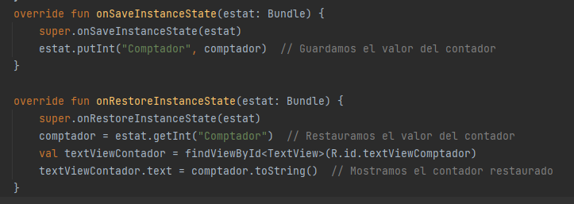
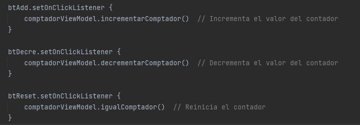

# Anàlisi de tecnologies per a aplicacions en dispositius mòbils

## Introducció
En aquesta tasca, explorarem i reflexionarem sobre els conceptes clau de les aplicacions mòbils en Android. Aquests inclouen:

- **Estructura d'un projecte i fitxers principals**
- **Activitats: Què són i com s'organitzen**
- **Cicle de vida d'una activitat**
- **Manteniment de l'estat amb Bundles**
- **Arquitectura Android: MVVM**
- **Conceptes de Jetpack Compose**

## Lliurament
Creeu un repositori a GitHub per incloure la memòria i els projectes de comptador modificats, explicant i justificant cada pas i solució aplicada.

---

## Bloc 1. Activitats sobre el comptador

### 1. Anàlisi de l'estructura del projecte

- El primer que hem fet ha sigut accedir als materials del projecte base que ens són necessaris per dur a terme el nostre projecte. Hem visitat el repositori de GitHub i descarregat els recursos de la unitat mitjançant aquest enllaç [documentació oficial](https://github.com/joamuran/RecursosPMDM).
---

### 2. Modificacions inicials
- A la primera activitat, haurem d'implementar un comptador. Un cop afegits els botons per reiniciar-lo i decrementar-lo, observarem que la rotació de la pantalla provoca la pèrdua de les dades del comptador. Per aquest motiu, haurem de gestionar adequadament els cicles de vida, ja que no tots estan configurats correctament.

- A la segona activitat, que se centra en el projecte del comptador amb l'arquitectura MVVM, haurem d'introduir les modificacions necessàries perquè suporti la funcionalitat de reiniciar i decrementar el comptador. Per aconseguir-ho, caldrà definir les funcions pertinents dins del ViewModel i utilitzar-les des de la interfície d'usuari.

- A la tercera activitat, treballarem amb el projecte ComptadorComposable, on modificarem el codi necessari per afegir els botons que permetin disminuir i reiniciar el comptador. Per això, ens resultarà útil la funció composable Row, que ens permetrà col·locar diversos elements composables en una fila, de manera similar a com Column ho fa en una columna.
---

### 3. Activitats sobre el cicle de vida i pèrdua d'estat
- En Android, una activitat passa per diverses fases que es poden controlar mitjançant els mètodes del seu cicle de vida, com ara onStart(), onResume(), onPause(), onStop(), onRestart() i onDestroy(). Aquests mètodes permeten reaccionar als canvis d'estat de l'activitat i gestionar correctament els recursos o mantenir l'estat de l'aplicació. Implementant aquests mètodes, podem assegurar-nos que l'aplicació funcioni de manera adequada davant canvis, com ara la rotació de la pantalla o la transició entre aplicacions.

- onStart(): Es crida quan l'activitat es fa visible per a l'usuari.
- onResume(): S'executa quan l'activitat comença a interactuar amb l'usuari.
- onPause(): S'invoca quan el sistema es disposa a deixar l'activitat en pausa, generalment quan una altra activitat es col·loca per damunt d'ella.
- onStop(): S'executa quan l'activitat ja no és visible.
- onRestart(): Es crida quan l'activitat està a punt de ser reiniciada després d'haver estat aturada.
- onDestroy(): Este mètode es crida just abans que l'activitat siga destruïda.
---

### 4. Intents entre activitats
- Per a mantindre l'estat de l'aplicació, com el valor del comptador en aquest cas, quan la pantalla rota o hi ha altres canvis en la configuració, és necessari utilitzar els mètodes onSaveInstanceState() i onRestoreInstanceState().

- Amb aquesta implementació, si gires la pantalla, el valor del comptador es guardarà abans que l'activitat siga destruïda i es restaurarà automàticament en recrear-se.

---

## 5. Components d'arquitectura d'Android: MVVM

- En la arquitectura MVVM (Model-View-ViewModel), las interaccions dels usuaris, com incrementar o decrementar el contador, se manejen a través del ViewModel.Se han añadit botons en la vista que, al ser presionats, criden a les funcions específiques en el ViewModel.

---

## 6. Conceptes i forma de treball de Jetpack Compose

- En la última part del proyecte, utilitzant Jetpack Compose, se modifiquen els diseñs del contador per agregar botons adicionals que permitixen decrementar y reiniciar el contador.

---

